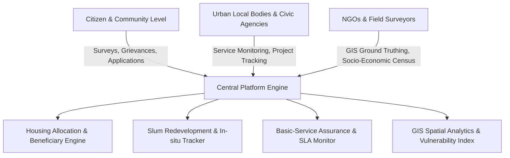

# Affordable Housing, Slum Redevelopment and Basic-Service Assurance 🏙️

[](https://opensource.org/licenses/MIT)
[]()
[]()

An integrated, data-driven framework and platform aimed at transforming informal settlements, coordinating equitable affordable housing delivery, and ensuring uninterrupted delivery of essential municipal services (water, sanitation, energy, waste management) for vulnerable urban communities.

---

## 🎯 Vision & Objective

Rapid urbanization often outpaces infrastructure, leading to the proliferation of informal settlements and severe deficits in basic civic amenities. **Affordable Housing, Slum Redevelopment, and Basic-Service Assurance** bridges the gap between civic administration, urban planners, developers, NGOs, and citizens through:

1. **Equitable Housing Allocation**: Transparent beneficiary identification, income-linked eligibility validation, and lifecycle subsidy tracking.
2. **In-situ Upgrading & Slum Rehabilitation**: Digital surveying, socio-economic baseline census, parcel mapping, transit accommodation monitoring, and rehabilitation tracking.
3. **Basic Service Assurance**: Real-time service delivery tracking (clean drinking water, functional sanitation, reliable electricity, and municipal solid waste collection) with automated SLA breach alerts.
4. **Spatial Analytics & Vulnerability Indexing**: GIS-enabled mapping of informal clusters, infrastructure deficit heatmaps, and evidence-based resource allocation.

---

## 🏗️ Core Pillars & Architecture



### 1. 🏘️ Affordable Housing Management
- **Beneficiary Registry**: Digital identity verification, household income tier classification (EWS / LIG / MIG), and de-duplication across welfare programs.
- **Project Catalog & Inventory**: Real-time unit availability across public-private partnership (PPP) housing projects.
- **Subsidy & Financing Integration**: Transparent tracking of credit-linked subsidies, direct benefit transfers, and affordable home loan disbursement milestones.

### 2. 🗺️ Slum Redevelopment & In-Situ Upgrading
- **GIS-Enabled Cadastral Mapping**: High-resolution boundary demarcations, drone/satellite survey overlays, and structure tagging.
- **Biometric & Socio-Economic Census**: Digital household enumeration ensuring cut-off date integrity and tenant/owner rights protection.
- **Rehabilitation Lifecycle Tracking**: End-to-end monitoring from eligibility determination to transit camp accommodation and final permanent allotment handover.

### 3. 🚰 Basic-Service Assurance
- **Water Supply Assurance**: Daily water supply scheduling, tanker tracking, and tap connection status across clusters.
- **Sanitation & Drainage**: Community toilet seat-to-user ratio analysis, desludging scheduling, and stormwater drainage health monitoring.
- **Power & Street Lighting**: Grid coverage, metering verification, and dark-spot elimination via solar/street lighting trackers.
- **Solid Waste Management**: Door-to-door collection audit, community dustbin placement, and clearing frequency verification.
- **Civic Grievance Redressal**: Geo-tagged issue reporting with time-bound resolution workflows and citizen feedback loops.

### 4. 📊 Urban Vulnerability & Spatial Insights
- **Multidimensional Vulnerability Index (MVI)**: Composite scoring factoring housing stability, access to water, sanitation, health, and hazard vulnerability (flood, fire).
- **Decision Support System (DSS)**: Prioritizes municipal budget and infrastructure deployments based on empirical vulnerability scores.

---

## 📂 Repository Structure

```text
.
├── docs/                   # Architectural blueprints, policy frameworks, and API specifications
│   ├── architecture.md     # System architecture and technical design
│   ├── data-schema.md      # Data schemas for housing, surveys, and utilities
│   └── service-slas.md     # Service level benchmark definitions
├── src/                    # Source code (services, APIs, frontend UI, analytics engines)
├── data/                   # Sample datasets, indicator dictionaries, and GIS GeoJSON templates
├── tests/                  # Unit and integration test suites
├── .gitignore              # Standard Git ignore configurations
├── LICENSE                 # Open-source MIT License
└── README.md               # Repository documentation and overview
```

---

## 🚀 Getting Started

### Prerequisites
- Node.js (>= 18.x) or Python (>= 3.10) depending on chosen module runtimes
- Git
- PostgreSQL with PostGIS extension (for spatial GIS storage) or SQLite (for local development)

### Quick Start
```bash
# Clone the repository
git clone https://github.com/vishal88736/affordable-housing-slum-redevelopment-and-basic-service-assurance.git

# Navigate to project directory
cd affordable-housing-slum-redevelopment-and-basic-service-assurance

# Explore documentation
cat docs/architecture.md
```

---

## 🤝 Contributing

Contributions are welcomed! Whether you are an urban planner, GIS engineer, full-stack developer, or policy researcher:
1. Fork the Project
2. Create your Feature Branch (`git checkout -b feature/AmazingFeature`)
3. Commit your Changes (`git commit -m 'Add some AmazingFeature'`)
4. Push to the Branch (`git push origin feature/AmazingFeature`)
5. Open a Pull Request

---

## 📜 License

Distributed under the MIT License. See [LICENSE](file:///home/vishal/D%20drive/SEVA%20FIRST/LICENSE) for more information.
