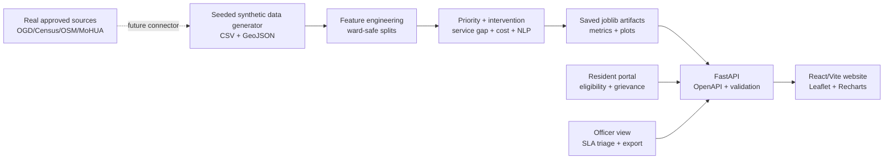

# NagarSeva

**Make every neighbourhood safer, healthier and heard.**

NagarSeva is a civic-tech decision-support and service-assurance platform for
affordable housing, slum redevelopment and basic services in the Mumbai
Metropolitan Region (Mumbai wards, Thane, Kalyan, Ambarnath and Ulhasnagar).
It helps a municipal or SRA team answer four connected questions:

1. Which pockets need attention first?
2. Which intervention is the best starting option: in-situ, upgrading,
   relocation or rental housing?
3. Can the proposal work financially under visible assumptions?
4. Do water, sanitation, power, waste and health services arrive after
   handover?

> **Important:** this repository is a fully working demo built with seeded,
> synthetic data. Synthetic numbers are clearly labelled in the website,
> API, model artifacts and presentation. They are not official statistics,
> settlement boundaries, eligibility determinations or investment advice.

## Architecture



## Demo first (two minutes)

1. Start with `make all`, then open <http://localhost:5173>.
2. Click **Demo mode** in the top bar. It walks through the priority map,
   NS-0766 pocket detail, the cross-subsidy simulator and the resident portal.
3. On **Priority map**, switch between Priority, Flood, Fire and Service
   modes, then click the red NS-0766 dot.
4. In **Pocket detail**, point out the radar, model reasons, top-two
   intervention probabilities and cost/timeline uncertainty.
5. In **Redevelopment simulator**, move market rate or FSI. Explain that the
   margin and verdict are transparent screening maths, not a black box.
6. In **Resident portal**, run the eligibility wizard and submit a grievance
   in English, Hindi, Marathi or Hinglish. Open Officer view to show the
   predicted urgency queue.

## Quick start

```bash
cd nagarseva
make all
# API docs: http://localhost:8000/docs
# Website:  http://localhost:5173
```

If dependencies are already present, the shorter offline-friendly sequence is:

```bash
make data
make train
make api       # terminal 1
make web       # terminal 2
```

The website automatically falls back to `website/src/data/fallback.json` if
the API is down, so the product walkthrough remains usable without a server.

## Product surfaces

- **Landing / mission control:** impact counters, four-step workflow, policy
  alignment and synthetic-data notice.
- **City dashboard:** Leaflet MMR map, filters, tier colours, ranked queue and
  flood/fire/service heat modes.
- **Pocket detail:** service radar, explainable priority reasons, top-two
  intervention recommendation, cost band and delivery uncertainty.
- **Redevelopment simulator:** FSI, rehab entitlement, market rate, cost and
  sales share sliders; viability, margin, IRR proxy, waterfall and sensitivity.
- **Budget optimiser:** vulnerable-share and ward constraints, selected map,
  Pareto frontier and AI-vs-uniform comparison.
- **Service assurance:** service-level scorecards, traffic lights and ward
  accountability board.
- **Resident portal:** simple-language scheme screening, multilingual
  grievance form, Web Speech API button and complaint tracker.
- **Officer view:** urgency queue, SLA breach flags and export affordance.
- **Methodology & ethics:** model cards, fairness notes, privacy approach and
  human-in-the-loop statement.

## Data and real-data path

`model/src/generate_data.py` creates approximately 1,500 pocket records,
20,000 grievances, 400 project histories and 10,000 household samples. It
uses `SEED = 20261008`, calibrated distributions and deliberately injects
3–8% missingness plus a few outliers. Correlations include higher flood risk
near creek-like coordinates, lower income with more kutcha homes, and weaker
service access with poverty and risk. Polygons are plausible demo geometry,
not actual slum boundaries.

See `model/data/README.md` for the documented plug points: data.gov.in,
Census of India, NFHS-5, OpenStreetMap, Sentinel-2, Google Open Buildings,
WorldPop, MoHUA dashboards, and BMC/TMC open data. The
`load_real_data()` stub intentionally raises until an approved, licensed
connector is implemented. A production replacement should preserve the
canonical table/API contracts, remove direct identifiers, validate geography,
and record consent, licence and provenance.

## Models

| Model | Approach | Demo metric / output |
| --- | --- | --- |
| Redevelopment priority | Gradient boosting regression over ward-held-out splits | R² 0.981, MAE 1.72, rank correlation 0.994; 0–100 score and tier |
| Intervention recommender | Gradient boosting policy-labelled multiclass model | Macro-F1, confusion matrix, top two probabilities and reasons |
| Service gap | Random forest against water/toilet/power/waste thresholds | F1 0.890, ROC-AUC 0.954; 90-day failure probability and assurance index |
| Cost + delay | Random forest regressors with empirical uncertainty bands | MAE/R² plus ±1.28 residual standard deviations |
| Grievance NLP | character TF-IDF + logistic regression | per-class F1; Hindi, Marathi and Hinglish-friendly characters |
| Feasibility | deterministic cross-subsidy rules | saleable area, margin, IRR proxy, break-even and tornado |
| Optimiser | PuLP ILP when installed; transparent greedy fallback otherwise | budget, vulnerability share, ward coverage and Pareto points |

Generated artifacts live in `model/artifacts/`; model plots live in
`presentation/assets/`. SHAP is optional: `model/src/explain.py` attempts a
SHAP explainer when installed and always returns a deterministic human-readable
reason fallback. The API loads artifacts once at startup and falls back to
heuristics if they are not present.

## Policy alignment

The workflow is intentionally designed to complement PMAY-Urban, Maharashtra’s
SRA scheme, Swachh Bharat Mission-Urban, AMRUT, Jal Jeevan Mission, SDG 6 and
SDG 11. The demo does not claim official scheme eligibility; the resident
wizard is a transparent screening conversation that points to verification.

## Tests and quality checks

```bash
make test
```

This runs feasibility mathematics, optimiser budget/fairness constraints,
API endpoint contracts and a production Vite build. Run `python
model/src/data_quality.py` to refresh the markdown report at
`model/data/processed/data_quality_report.md`.

## Limitations and what real data would change

- Synthetic features and templates are useful for product validation, not
  causal policy claims. The perfect synthetic NLP split is especially not a
  proxy for real multilingual performance.
- Coordinates, polygons, household counts, costs and impact counters are
  illustrative. Real outputs require field verification, approved ward/asset
  data, resident consultation, and uncertainty calibration.
- The recommendation does not make a displacement, demolition or eligibility
  decision. Tenure, hazard and land ownership require statutory review.
- Fairness checks are represented in the training design and methodology view;
  a real deployment needs outcome audits by city, income band, language,
  gender, disability and tenure status, with an appeals process.
- Financial IRR is an indicative screening proxy. A real DPR needs land,
  financing, taxes, phasing, maintenance, approvals, TDR and market studies.
- The offline fallback is intentionally a small representative sample; the
  full API data is needed for operational scale tests.

With real data, we would add a data-governance board, resident data trust,
ward-level service SLAs, approved grievance identifiers, satellite/OSM
validation, periodic drift monitoring, independent fairness audits and a
human appeal workflow before any decision affects housing status.
