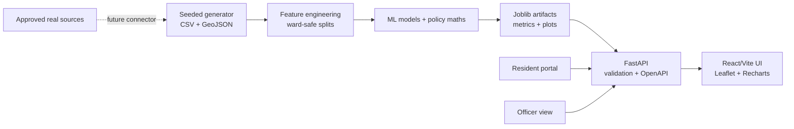

# NagarSeva Project Documentation

**Document version:** 1.0  
**Last updated:** 08 October 2026  
**Status:** Demo-ready local implementation  
**Canonical source:** `docs/NagarSeva_Project_Documentation.md`  
**Generated Word file:** `docs/NagarSeva_Project_Documentation.docx`

> NagarSeva is an AI-powered decision-support and service-assurance platform
> for affordable housing, slum redevelopment and basic-service assurance in
> the Mumbai Metropolitan Region. This repository uses seeded synthetic data.
> Synthetic values are not official statistics, settlement boundaries,
> eligibility decisions or investment advice.

## 1. Executive summary

NagarSeva connects four public-sector decisions that are usually managed
separately:

1. **Prioritise:** identify pockets where vulnerability, density, hazard and
   service deficits overlap.
2. **Recommend:** compare in-situ redevelopment, upgrading, relocation and
   rental housing with probabilities and plain-language reasons.
3. **Simulate:** test FSI, rehab entitlement, market rate, construction cost,
   TDR and sales-share assumptions before a detailed project report.
4. **Assure:** track water, sanitation, power, waste, health access and
   grievances after handover.

The case-study geography is Mumbai, Thane, Kalyan, Ambarnath and Ulhasnagar in
Maharashtra. The policy bridge is PMAY-Urban, Maharashtra SRA, SBM-Urban,
AMRUT, Jal Jeevan Mission, SDG 6 and SDG 11.

## 2. Product principles

- **AI recommends; officials decide; residents participate.**
- **Synthetic data is labelled everywhere.** It is used to demonstrate the
  workflow safely, not to describe a named settlement.
- **Reasons travel with recommendations.** A score is accompanied by
  contributors, uncertainty and a human validation step.
- **The API remains useful without trained artifacts.** It uses a transparent
  fallback heuristic when a model is unavailable.
- **The website remains usable without the API.** It falls back to a small
  static sample and client-side feasibility calculations.
- **Data minimisation is the default.** No resident names, phone numbers or
  addresses are generated.

## 3. Architecture



### Request flow

```text
generate_data.py
    → model/data/synthetic/*.csv and pockets.geojson
    → train_*.py
    → model/artifacts/*.joblib and metrics.json
    → FastAPI loads models and tables at startup
    → React calls API or uses src/data/fallback.json
```

## 4. Technology stack

### Python

Python is used for data generation, modelling, prediction, the FastAPI backend,
testing and PowerPoint generation.

| Package | Use |
|---|---|
| NumPy | Seeded numerical generation |
| Pandas | Tables and feature preparation |
| Scikit-learn | Regression, classification, NLP and metrics |
| Joblib | Model serialisation |
| FastAPI | REST API and OpenAPI documentation |
| Pydantic | Request validation |
| Uvicorn | Local API server |
| PuLP | Integer optimisation when available |
| Matplotlib | Plots and pitch-deck charts |
| Python-pptx | PowerPoint generation |
| Pytest | Automated tests |

SHAP is optional. `model/src/explain.py` attempts to use it when installed and
otherwise returns deterministic human-readable explanations.

### TypeScript and frontend

| Package | Use |
|---|---|
| React | Component-based UI |
| Vite | Development server and production build |
| TypeScript | Static typing |
| Leaflet / React Leaflet | Interactive map |
| Recharts | Radar, area and bar charts |
| Lucide React | Accessible icons |
| Tailwind/PostCSS | Styling configuration |
| Custom CSS | Main civic-tech design system |

## 5. Repository structure

```text
nagarseva/
├── README.md                         Quick project overview and demo
├── Makefile                          setup, data, train, api, web, test, docs
├── docs/                             Maintained documentation
├── model/                            Data, models, API and tests
├── website/                          React/Vite frontend
└── presentation/                     PowerPoint, speaker notes and assets
```

### Root files

#### `README.md`

The short operational README. It covers setup, demo flow, architecture,
policy alignment, model summaries, limitations and real-data migration.

#### `Makefile`

| Command | Action |
|---|---|
| `make setup` | Install Python and frontend dependencies |
| `make data` | Generate CSV, GeoJSON and quality report |
| `make train` | Regenerate data and train all model jobs |
| `make api` | Start FastAPI on port 8000 |
| `make web` | Start Vite on port 5173 |
| `make all` | Setup, data, training and background servers |
| `make test` | Pytest plus production frontend build |
| `make docs` | Regenerate the Word documentation file |
| `make clean` | Remove frontend dependencies and build output |

## 6. Data layer

### `model/data/README.md`

Documents future real-data plug points including data.gov.in, Census of India,
NFHS-5, OpenStreetMap, Sentinel-2, Google Open Buildings, WorldPop, MoHUA and
BMC/TMC open data.

### `model/data/raw/`

Reserved for licensed source data. It is intentionally empty in the demo.
Never place unapproved personal data in this directory.

### `model/data/synthetic/`

The seeded generator creates approximately:

| File | Rows | Purpose |
|---|---:|---|
| `slum_pockets.csv` | 1,500 | Pocket geography, vulnerability, hazard and tenure |
| `service_access.csv` | 1,500 | Water, sanitation, power, waste and health access |
| `grievances.csv` | 20,000 | Multilingual complaint text and resolution history |
| `redevelopment_projects.csv` | 400 | Historical-style project cost and delivery records |
| `households_sample.csv` | 10,000 | Household screening features and demo labels |
| `budget_scenarios.csv` | 5 | Optimisation example budgets |
| `pockets.geojson` | 1,500 features | Illustrative polygons for the map |
| `generation_manifest.json` | 1 | Seed and row-count metadata |

#### Pocket fields

`pocket_id`, `ward`, `city`, `lat`, `lon`, `area_sqm`, `households`,
`population`, `density_per_ha`, income, poverty, kutcha-house share,
women-headed share, migrant share, land ownership, flood risk, fire risk,
structural risk, distances to transit/hospital/school, tenure security and
settlement age.

#### Service fields

Daily water hours, piped-water share, water-quality flag, toilets per 100
people, open-defecation share, sewer connection, legal electrification, outage
hours, waste collection frequency, drain blockages, clinic access and anganwadi
access.

#### Grievance fields

Complaint ID, pocket ID, timestamp, English/Hindi/Marathi/Hinglish-style text,
category, severity, resolution days and resolved flag.

### `model/data/processed/data_quality_report.md`

Generated by `data_quality.py`. It reports row counts, columns, missing cells,
duplicates and synthetic-data quality notes.

## 7. Data generation and reproducibility

### `model/src/generate_data.py`

The generator uses:

```text
SEED = 20261008
```

It injects realistic directionality, 3–8% missing values, noise and outliers.
It creates plausible coordinates around the MMR but does not recreate any
actual settlement.

The following real-data loader stubs are available:

```text
load_data_gov_india()
load_census_of_india()
load_nfhs()
load_openstreetmap()
load_sentinel2()
load_open_buildings()
load_worldpop()
load_mohua_dashboards()
load_bmc_tmc_open_data()
```

Each currently raises `NotImplementedError` until an approved connector is
implemented.

### `model/src/data_quality.py`

Loads all synthetic CSV files and writes the quality report.

## 8. Machine-learning layer

### `model/src/features.py`

Shared feature engineering utilities:

- Table loading
- Pocket/service joining
- Numeric conversion and missing-value handling
- Policy priority target creation
- Priority tier conversion
- Service assurance indices
- City and income-band fairness summaries

### `model/src/train_priority.py`

Trains both the priority regressor and intervention recommender.

Priority features include poverty, density, kutcha homes, flood risk, fire
risk, structural risk, hospital distance, tenure security, water, toilets,
power and waste variables.

The priority target is a transparent synthetic policy composite. It is not an
independent ground-truth label.

Current synthetic result:

```text
R²:                0.981
MAE:               1.72
Rank correlation:  0.994
```

The intervention classifier returns:

```text
in_situ_SRA
upgrading
relocation
rental_housing
```

Current synthetic macro-F1 is approximately `0.760`.

### `model/src/train_intervention.py`

Compatibility entry point for the intervention recommender. The actual
training is kept in `train_priority.py` so both models share the same ward-safe
split and artifact workflow.

### `model/src/train_service_gap.py`

Trains a random-forest classifier for 90-day failure risk. Demo failure rules
include:

```text
water < 4 hours/day
toilets < 15 per 100 people
outages > 12 hours/week
waste collection < 3 times/week
```

Current synthetic result:

```text
F1:       0.890
ROC-AUC:  0.954
```

### `model/src/train_cost.py`

Trains cost-per-square-foot and delay-month regressors. It evaluates with
held-out wards and stores empirical residual uncertainty intervals.

This is a screening estimator. A real implementation needs location, financing,
approvals, phasing, contractor and market-absorption features.

### `model/src/train_grievance_nlp.py`

Uses character TF-IDF n-grams and logistic regression. Character n-grams are
useful for Hindi, Marathi, Hinglish and spelling variation.

The synthetic score is high because the demo text is template-heavy. It must
not be treated as production multilingual accuracy.

### `model/src/feasibility.py`

Implements deterministic cross-subsidy mathematics. It calculates gross built
area, free rehab area, saleable area, support, cost, profit, margin, IRR proxy,
break-even rate and sensitivity scenarios.

### `model/src/optimizer.py`

Selects pockets under a budget while considering vulnerable share and ward
coverage. It uses PuLP when installed and a greedy fallback otherwise.

### `model/src/explain.py`

Provides plain-language priority reasons and an optional SHAP integration.

### `model/src/predict.py`

Programmatic facade for priority, intervention, service, cost and grievance
predictions without calling HTTP endpoints.

## 9. Artifacts

`model/artifacts/` contains generated model outputs:

| File pattern | Purpose |
|---|---|
| `*_model.joblib` | Trained models and feature metadata |
| `*_metrics.json` | Metrics and fairness summaries |
| `priority_scores.csv` | Score and tier for every pocket |
| `service_gap_scores.csv` | Failure probability and assurance index |

Regenerate artifacts with:

```bash
make train
```

Do not hand-edit Joblib files. Change code or data, then retrain.

## 10. API layer

### `model/api/schemas.py`

Defines Pydantic request contracts for priority, intervention, cost,
feasibility, optimisation, grievances and eligibility.

### `model/api/main.py`

Loads models and tables at startup, enables CORS, exposes OpenAPI documentation
and provides fallback logic when artifacts are missing.

Available endpoints:

```text
GET  /health
GET  /pockets
GET  /pockets/{id}
POST /priority/score
POST /intervention/recommend
GET  /service/{pocket_id}/assurance
POST /cost/estimate
POST /feasibility/simulate
POST /optimize
POST /grievance/classify
POST /grievances
GET  /grievances
POST /eligibility/check
GET  /stats/summary
```

API documentation is available at:

```text
http://localhost:8000/docs
```

The current live grievance store is in memory. It resets when the API restarts.
Production should use PostgreSQL/PostGIS or an approved municipal grievance
system.

## 11. Test layer

### `model/tests/test_feasibility.py`

Tests financial calculations and invalid inputs.

### `model/tests/test_optimizer.py`

Tests budget and vulnerable-share constraints plus Pareto output.

### `model/tests/test_api.py`

Tests the main API endpoint contract.

Run:

```bash
python -m pytest model/tests -q
```

## 12. Frontend layer

### `website/src/App.tsx`

Application shell containing navigation, sidebar, dark mode, language switcher,
demo mode and page selection.

### `website/src/lib/api.ts`

API client with offline fallback. It provides:

- API request helpers
- Local feasibility calculations
- Static fallback behaviour
- LocalStorage grievance persistence
- Indian currency and number formatting

### `website/src/data/fallback.json`

Representative offline pocket data and summary counters. This allows the demo
to work when the backend is unavailable.

### `website/src/components/Shared.tsx`

Reusable cards, badges, panels, metrics, notes and the Leaflet pocket map.

### `website/src/styles.css`

The primary design system. It contains colours, typography, responsive grids,
dark mode, dashboard layouts, map styles, simulator styles and resident/admin
views.

### Frontend pages

| Page | Main function |
|---|---|
| `Landing.tsx` | Mission, counters, workflow and policy alignment |
| `Dashboard.tsx` | Priority map, filters, rankings and heat modes |
| `PocketDetail.tsx` | Service radar, reasons, intervention and cost band |
| `Simulator.tsx` | Cross-subsidy feasibility and sensitivity |
| `Optimizer.tsx` | Budget selection, map, Pareto and comparison |
| `Assurance.tsx` | Service scorecards and ward compliance |
| `Resident.tsx` | Eligibility, grievance and complaint tracking |
| `Admin.tsx` | Urgency queue and SLA view |
| `Methodology.tsx` | Model cards, limitations, fairness and privacy |

### `website/public/mmr-map.svg`

An offline illustrative basemap. It is not an official geographic boundary
dataset.

## 13. Presentation layer

### `presentation/generate_pitch.py`

Generates the 13-slide PowerPoint from local chart assets using Python-pptx.

Run:

```bash
python presentation/generate_pitch.py
```

### `presentation/NagarSeva_Pitch.pptx`

Judge-ready pitch deck covering the problem, solution, methodology, models,
product, financial engine, resident design, impact, scalability and ethics.

### `presentation/pitch_script.md`

Contains the 3-minute pitch, 7-minute notes and 10 likely judge questions with
answers.

## 14. Local setup

```bash
cd nagarseva
make all
```

Open:

```text
Website:   http://localhost:5173
API:       http://localhost:8000
API docs:  http://localhost:8000/docs
```

If dependencies are already installed:

```bash
make data
make train
make api     # terminal 1
make web     # terminal 2
```

## 15. Demo script

1. Start with the landing-page counters and policy alignment.
2. Click **Demo mode**.
3. On the map, switch Priority, Flood, Fire and Service modes.
4. Open `NS-0766` and explain the priority reasons.
5. Show the top-two intervention recommendation.
6. Change FSI and market rate in the simulator.
7. Show the optimiser's vulnerable-share and ward constraints.
8. Submit a multilingual grievance from the resident portal.
9. Open the officer queue and show urgency/SLA handling.
10. Finish on Methodology & Ethics.

## 16. Optimisation roadmap

### P0 — before a real pilot

- Replace CSV storage with PostgreSQL/PostGIS.
- Implement approved real-data connectors.
- Add authentication and role-based access control.
- Replace in-memory grievances with durable storage.
- Add explicit consent, retention and audit policies.
- Replace illustrative polygons with approved GIS data.

### P1 — model quality

- Replace synthetic policy target with verified field labels.
- Add temporal and spatial validation.
- Calibrate model probabilities.
- Add subgroup audits for city, income, language, gender, disability and
  tenure.
- Improve cost features with project finance and approval data.
- Create a real multilingual grievance annotation process.

### P2 — product quality

- Add React Router and lazy-loaded pages.
- Split Leaflet/Recharts into separate bundles.
- Implement real CSV/PDF download actions.
- Add true marker clustering.
- Add real complaint assignment and status history.
- Add notifications and SLA escalation.

### P3 — operations

- Containerise API and web.
- Add CI for Python and TypeScript tests.
- Add model registry and data-version tracking.
- Add monitoring, drift detection and rollback.
- Add independent fairness and privacy review.

## 17. Limitations

- Synthetic data is not evidence about any named settlement.
- Synthetic NLP performance is not real multilingual performance.
- Financial IRR is an indicative screening proxy.
- The model must not decide demolition, displacement or eligibility.
- Land ownership and hazard signals require statutory review.
- Resident consultation and field verification are mandatory before action.
- The current map is illustrative and offline.
- The API currently keeps live grievances in memory.

## 18. Maintenance process

This Markdown file is the canonical documentation source. The Word file is a
generated distribution copy.

When changing the project:

1. Update the source Markdown in `docs/`.
2. Update the relevant code or data documentation section.
3. Add an entry to `docs/CHANGELOG.md`.
4. Run `make docs` to regenerate the `.docx`.
5. Run `make test`.
6. Update model metrics if training data or model code changed.
7. Update the presentation if user-facing behaviour or metrics changed.
8. Confirm synthetic-data labels remain visible.

Never manually edit only the `.docx`; it will be overwritten the next time
`make docs` runs.
